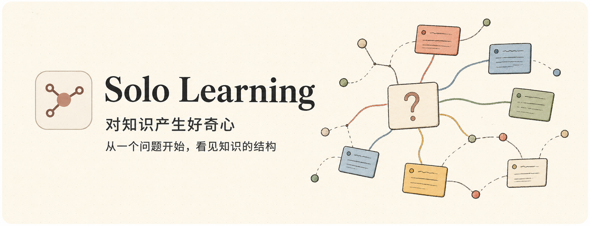
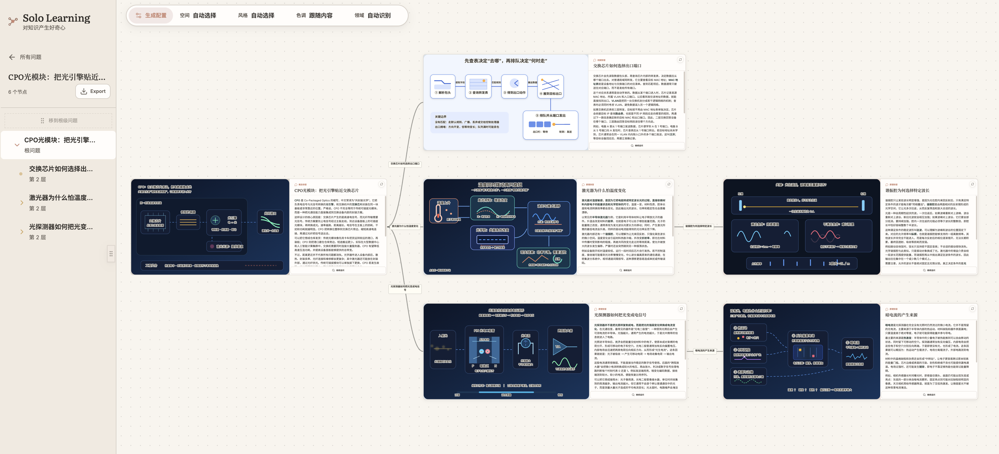

<p align="center">
  
</p>

从一个问题开始，用可交互的 SVG 图解和知识画布建立领域认知。

## 项目截图



## 功能

- 同时生成文字快答与 SVG 图解
- 拆解粘贴文本、带图片的 PDF，以及 Markdown + 图片附件 ZIP
- 在无限画布中组织、缩放和连接知识卡片
- 通过追问持续扩展知识树
- 支持 Codex、Claude Code 和 OpenCode CLI，默认使用 Codex
- 导出可独立浏览的单文件 HTML

## 拆书模式

切换到「拆资料」后，可以直接粘贴文章，或上传带图片的 PDF、Markdown + 图片附件 ZIP。Solo Learning 会读取正文、章节和图片，再把资料转换成可继续探索的知识画布。

- **精简**：保留原著一级章节的边界与顺序，在同一章内合并重复或紧密相关的小节。生成前会先检查章节覆盖、重复目标和层级关系；前言、导航、结论等可吸收到总览，画布最多三级、最多 20 个节点。
- **详细**：尽量保留原著标题、顺序和章节层级，适合逐章阅读与核对原文。

图片、图表、流程图和架构图会与正文一起识别，并按原始语义重新组织成可交互 SVG。精简模式先完成结构规划和校验，通过后才开始批量生成图解，避免结构不合理时浪费生成时间。

## 本地运行

要求：Node.js 18+，并至少安装且登录一个受支持的 Agent CLI。

```bash
npm install
npm run dev
```

打开 <http://localhost:5173>。API 默认监听 `127.0.0.1:8787`。

默认 Agent 是 Codex，也可以显式指定：

```bash
npm run agent -- --agent codex
```

模型、推理强度和速度也可以在启动时指定：

```bash
CODEX_MODEL=gpt-5.6-luna \
CODEX_REASONING_EFFORT=low \
CODEX_SERVICE_TIER=priority \
npm run dev
```

可用环境变量：

| 变量 | 说明 |
| --- | --- |
| `SOLO_DEFAULT_AGENT` | `codex`、`claude` 或 `opencode` |
| `SOLO_API_PORT` | API 端口，默认 `8787` |
| `CODEX_BIN` | Codex CLI 路径 |
| `CODEX_MODEL` | Codex 模型，默认 `gpt-5.6-sol` |
| `CODEX_REASONING_EFFORT` | 推理强度，默认 `medium`；GPT-5.6 支持 `none`、`low`、`medium`、`high`、`xhigh`、`max` |
| `CODEX_SERVICE_TIER` | 速度档位，默认 `priority`；可用值取决于账户，常用 `default`、`priority`，`ultrafast` 需要额外权限 |
| `CLAUDE_BIN` | Claude Code CLI 路径 |
| `OPENCODE_BIN` | OpenCode CLI 路径 |

## 构建

```bash
npm run build
npm run preview
```

运行数据保存在 `server/data/`，该目录不会提交到 Git。
